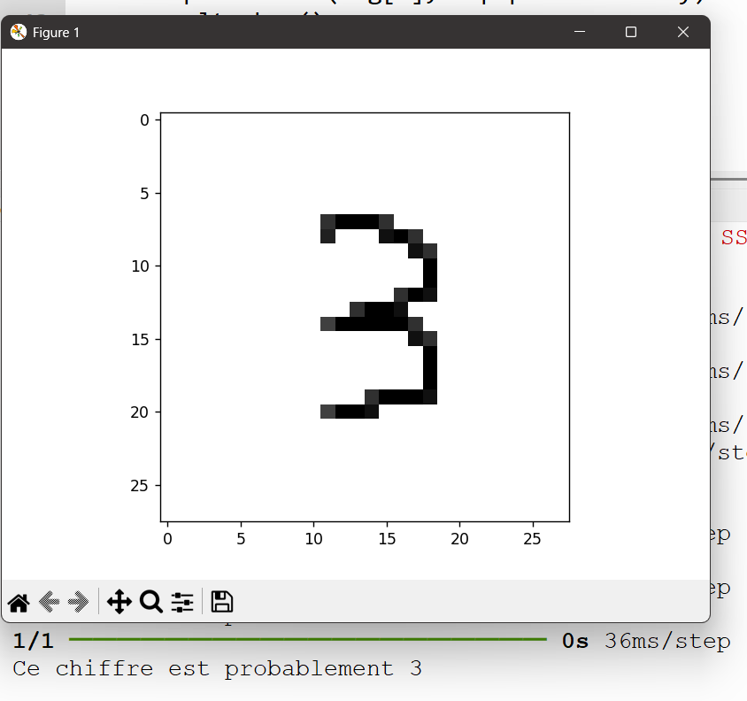

# 🧠 Handwritten Digit Recognition

A machine learning project that recognizes handwritten digits (0–9) using the MNIST dataset.  
The model is trained with a neural network and is designed to be deployed in a full-stack web application where users can draw digits and get predictions.

---

## 📌 Project Overview

This project aims to build a digit recognition system capable of classifying handwritten digits with high accuracy.  
The long-term goal is to make the model accessible through a web interface where users can draw a digit and receive a prediction.

Key features:
- Training a neural network on the MNIST dataset
- Image preprocessing and normalization
- Multiclass classification (digits 0–9)
- Model saving and reuse
- Designed for web deployment (full-stack ready)

---

## 🧠 Machine Learning Model

- **Dataset**: MNIST (60,000 training images, 10,000 test images)
- **Input**: 28×28 grayscale images
- **Output**: Digit class (0–9)

### Model Architecture
- Flatten layer (28×28 → 784)
- Dense layer (128 neurons, ReLU)
- Dense layer (128 neurons, ReLU)
- Output layer (10 neurons, Softmax)

### Training Configuration
- Optimizer: Adam
- Loss function: Sparse Categorical Crossentropy
- Metric: Accuracy
- Achieved accuracy: ~97–98% on test data

---

## 🛠️ Technologies Used

### Machine Learning
- Python
- TensorFlow / Keras
- NumPy
- Matplotlib

### Full-Stack (Planned / In Progress)
- TypeScript
- JavaScript
- Node.js
- TensorFlow.js
- Canvas API (for digit drawing)
- REST API

---
## ✏️ Example of Handwritten Digit

---

## 🔮 Future Improvements

- 🖌️ Create an interactive web interface allowing users to draw digits on a canvas
- 🌐 Deploy the model in a web application using TensorFlow.js
- 🧩 Full-stack integration with a Node.js backend and REST API
- ⚡ Real-time digit prediction in the browser
- 🎨 Improve user experience and visual feedback
- 🧠 Replace the dense neural network with a Convolutional Neural Network (CNN) for better accuracy
- 📊 Display prediction probabilities for each digit
- 🚀 Deploy the application online (Vercel, Netlify, or similar platforms)

